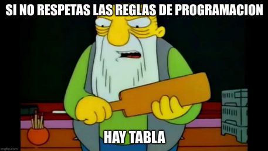

# Coding Style Guide

Everything here is a MUST except the recommendations inside parenthesis

## Variables

Variables MUST use camelCase

```php
$camelCase = 5;
```
## Constants

COnstants MUST be ALL_CAPS_AND_USE_UNDERSCORE_AS_SEPARATOR

```php
const ALL_CAPS_SNAKE = 5;
```

## Functions

Open Brackets in next line

```php
function camelCase()
{
    return "this is a function";
}
```

## Classes

Open brackets in next line

```php
class PascalCase
{
    function camelCase()
    {
        return 'this is a function inside a class';
    }
}
```

## if, else, else if

Open brackets in same line

```php
if(5 == 5){
    return 'this is true';
}
```

`else if` and `else` in the next line of closed bracket
```php
if(5 != 5){
    return 'this is false';
}
else if(6 == 5){
    return 'this is also false';
}
else{
    return 'This will execute';
}
```

## while, for
Open brackets in same line (recommended iterators names: i, j, k)
```php
for($i = 0; $i <= 5; i++){
    echo $i;
}

$j = 0;
while($j < 5){
    echo $j;
    $j += 1;
}
```

## Chaining Functions
When chaining functions each function should be in a new line, with the exception of getters.
```php
aFunction('some parameters')
->anotherFunction('more parametes')
->anotherAnotherFunction('even more parameters');
```

```php
$petOwner->getPet()->getName(); // This one is okay
```

```php
$petOwner->getPet()->doAFlip(); // This one is NOT okay
```

## Files

Files should be in PascalCase `Example.php`, `OtherExample.blade.php`.

## Associative Arrays

For associative arrays with more than three or more elements you should first create the empty array and push one item per line.

```php
$associativeArray = []; // This is okay
$associativeArray['someEntry'] = '1';
$associativeArray['otherEntry'] = '2';
$associativeArray['anotherEntry'] = '3';
```

```php
$associativeArray = ['someEntry'=>'1', 'otherEntry'=>'2', 'anotherEntry'=>'3']; // This is NOT okay
```

## Final Announcement

