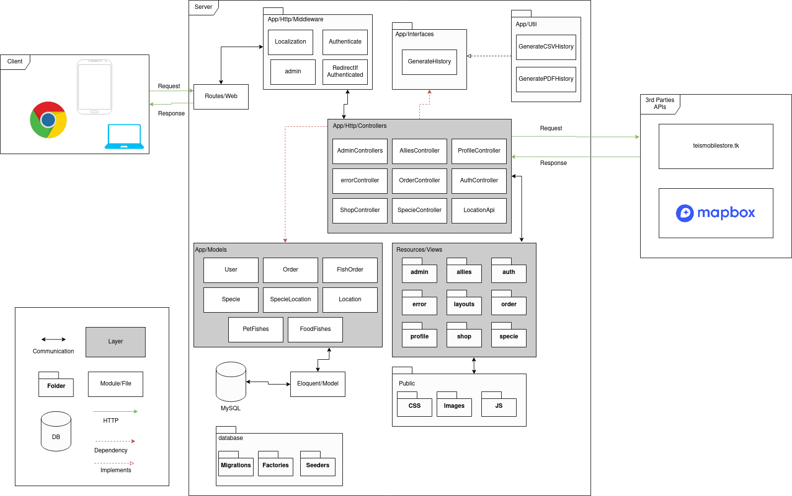

# Deliverable

## TEAM LOGO

## Description (Made by Juan Jose)

Adventure Fishalist is a project developed by Julián David Bueno Londoño, Juan Jose Madrigal Palacio and María Camila Morales Ríos. This project it's about create an E-commerce in which users can buy fish either to have them as a pet or as food. The E-commerce is going to be a web app wade in PHP through the Laravel framework. In this web users will be able to enter and create their profile in which they will be able to see and generate fish orders. In the web app users will be able to see a list of both pet and food fish, in the view of the fish they will be able to see the different information about that fish species, in addition to their geographic location on the map to know where that species lives.

## Class Diagram (Made by Juan Jose and Julián)

## Architecture (Made by Julián)

