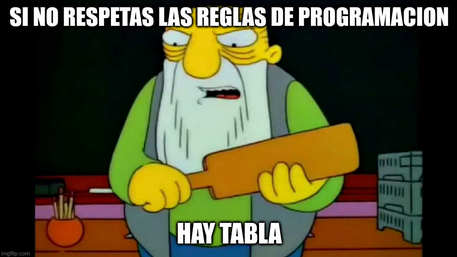

# Programming Rules

Everything in this file is a MUST except the recommendations inside the parenthesis.

Every controller and model should have a namespace.

## Routes File

Each route should be associated to a method inside a controller namespace using the following syntax:

each route should have a routeName with the convention `{controllerName}.{method}`

## Middlewares

The middlewares should be called from the routes file using functionChaining, NEVER call a middleware from inside a controller.

## Models

Models should have a multiline comment at the start of the class explaining the attributes of said model, ALL attributes should have getter and setter, non-fillable attributes should ONLY have getter.

## Controllers

Every method from every controller should always return a view, a redirect or `back()`

## Views

Every view should be BLADE.

Every view should extends from the `resources/views/layouts/CustomerApp.blade.php` except those of the admin panels, the views in `resources/views/admin` should extend from `resources/views/layouts/AdminApp.blade.php`.

You should NEVER use the `@php` tag.

You should NEVER use `@if(auth()->check())` or `@if(!auth()->check())` instead use `@auth` and `@guest`.

## Final Announcement

